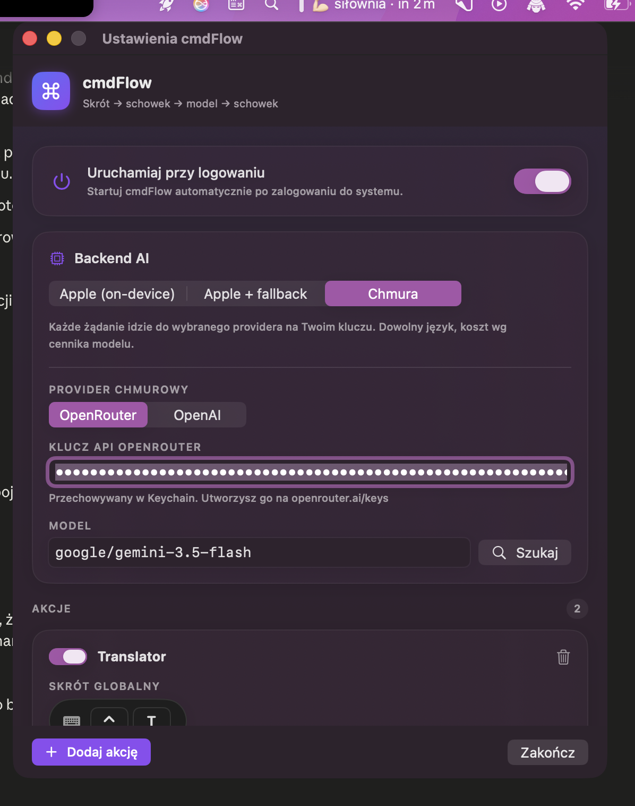

<div align="center">

# ⌘ cmdFlow

**Zaznacz. Kopiuj. Naciśnij skrót. Wklej wynik.**

Menu-barowa aplikacja na macOS, która przepuszcza tekst ze schowka przez model AI pod globalnym skrótem klawiszowym — domyślnie **on-device** (Apple Foundation Model), opcjonalnie przez **OpenRouter** lub **OpenAI**.

[](https://github.com/miekki-jerry/cmdFlow/releases)
[](LICENSE)
[](https://www.apple.com/macos/)

[**Landing page →**](https://cmdflow.vercel.app) &nbsp;·&nbsp; [Pobierz](https://github.com/miekki-jerry/cmdFlow/releases/latest) &nbsp;·&nbsp; [Autor: bogumilluc.pl](https://bogumilluc.pl)



</div>

---

## Po co to jest

Ciągle kopiuję jakiś fragment i chcę go szybko przerobić — przetłumaczyć, poprawić gramatykę, streścić — bez wklejania do ChatGPT, przełączania okien i kopiowania z powrotem. cmdFlow robi to jednym skrótem, na miejscu:

```
[globalny skrót]  →  tekst ze schowka  →  Twój prompt  →  model AI  →  wynik do schowka
```

Definiujesz **akcje** — każda to para *globalny skrót + prompt*. Jedna tłumaczy na angielski, druga poprawia gramatykę, trzecia streszcza. Kopiujesz tekst, naciskasz skrót, wklejasz wynik.

## Dlaczego trzy providery (i skąd polski problem)

Aplikacja powstała wokół **Apple Foundation Models** — modelu, który działa **lokalnie na Macu**: prywatnie, za darmo, bez kluczy API. Model radzi sobie świetnie w wielu językach (EN/DE/FR/ES/IT/PT/JA/KO/ZH).

Jest jednak jedno konkretne ograniczenie, które wyszło w testach: **polski tekst wejściowy jest odrzucany** przez guardrail modelu (`unsupportedLanguageOrLocale`), niedeterministycznie i bez obejścia po stronie promptu. To ograniczenie Apple, nie aplikacji — polski nie jest jeszcze oficjalnie wspieranym językiem wejściowym Apple Intelligence.

Dlatego cmdFlow ma **trzy tryby backendu**, które można przełączać w Ustawieniach:

| Tryb | Opis |
|---|---|
| **Apple (on-device)** | Model Apple Intelligence lokalnie. Prywatny, darmowy, bez klucza. Ograniczone języki. |
| **Apple + fallback** | Najpierw Apple; gdy odmówi (np. polski input), automatyczny fallback do chmury. **Rekomendowane dla polskiego.** |
| **Chmura** | Każde żądanie do wybranego providera na Twoim kluczu API. Dowolny język i model. |

Provider chmurowy: **OpenRouter** (300+ modeli, wbudowana wyszukiwarka) lub **OpenAI** (`gpt-4o`, `gpt-4o-mini`, `gpt-4.1`, …). Klucz API trzymany jest w **Keychain**, nie w plaintext.

## Jak działa

1. **Skopiuj** dowolny tekst (`⌘C`).
2. **Naciśnij** swój skrót — cmdFlow czyta schowek i uruchamia prompt.
3. **Wklej** (`⌘V`) — wynik jest już w schowku.

## Funkcje

- 🎹 **Globalne skróty** — Carbon `RegisterEventHotKey`, bez uprawnień Accessibility.
- ⚙️ **Wiele akcji** — każda z własnym skrótem i promptem, persystencja w UserDefaults.
- 🔒 **On-device by default** — tekst nie opuszcza Maca, dopóki nie wybierzesz chmury.
- ☁️ **OpenRouter + OpenAI** — własny klucz (w Keychain), wyszukiwarka modeli OpenRouter.
- 🎬 **Nagrywanie skrótu z animacją** — fale radaru, keycapy, ostrzeżenie o kolizjach z systemem.
- 🚀 **Uruchamianie przy logowaniu** — jeden przełącznik (`SMAppService`).
- 📍 **Menu bar** — bez ikony w Docku; ikona `⌘` zmienia stan (praca / sukces / błąd).

## Instalacja

Aplikacja jest **niepodpisana** (projekt open-source, bez Apple Developer Account), więc Gatekeeper wymaga jednorazowego potwierdzenia:

1. Pobierz `cmdFlow-x.y.z.dmg` z [Releases](https://github.com/miekki-jerry/cmdFlow/releases), otwórz i przeciągnij **cmdFlow** do **Aplikacji**.
2. Pierwsze uruchomienie: **prawy klik na cmdFlow → Otwórz** → *Otwórz*.
3. Jeśli macOS twierdzi, że aplikacja jest „uszkodzona":
   ```bash
   xattr -dr com.apple.quarantine /Applications/cmdFlow.app
   ```

## Wymagania

- **macOS 26 (Tahoe)+**, **Apple Silicon** (M1+)
- Tryb Apple: włączone **Apple Intelligence** (Ustawienia systemowe → Apple Intelligence & Siri)
- Tryb chmurowy: klucz API [OpenRouter](https://openrouter.ai/keys) lub [OpenAI](https://platform.openai.com/api-keys) — działa też, gdy urządzenie nie ma Apple Intelligence

## Budowanie ze źródeł

```bash
git clone https://github.com/miekki-jerry/cmdFlow.git
cd cmdFlow
swift build -c release          # kompilacja
./Scripts/build_app.sh 0.4.0    # złożenie cmdFlow.app w dist/
./Scripts/make_release.sh 0.4.0 # + .dmg i .zip
```

Wymaga Xcode 26+ / Swift 6.2+. Aplikacja to pakiet SPM składany do `.app` skryptem — bez pliku `.xcodeproj`.

## Architektura

| Komponent | Rola |
|---|---|
| `HotKeyManager` | Globalne skróty przez Carbon `RegisterEventHotKey` |
| `FoundationModelService` | Warstwa nad `FoundationModels` z retry i obsługą błędów |
| `CloudChat` | Wspólny klient chat/completions (OpenAI-compatible) |
| `OpenRouterService` / `OpenAIService` | Providerzy chmurowi + listowanie modeli OpenRouter |
| `Keychain` | Bezpieczne przechowywanie kluczy API |
| `LaunchAtLogin` | Uruchamianie przy logowaniu (`SMAppService`) |
| `AppState` | Persystencja akcji/ustawień, routing providerów, rejestracja skrótów |
| `ShortcutRecorder` / `DesignKit` | Animowany recorder i wspólny język wizualny |

## Autor

Stworzone przez **Bogumił Łuć** — [bogumilluc.pl](https://bogumilluc.pl).
Landing page: [cmdflow.vercel.app](https://cmdflow.vercel.app)

## Licencja

[MIT](LICENSE) © 2026 Bogumił Łuć
