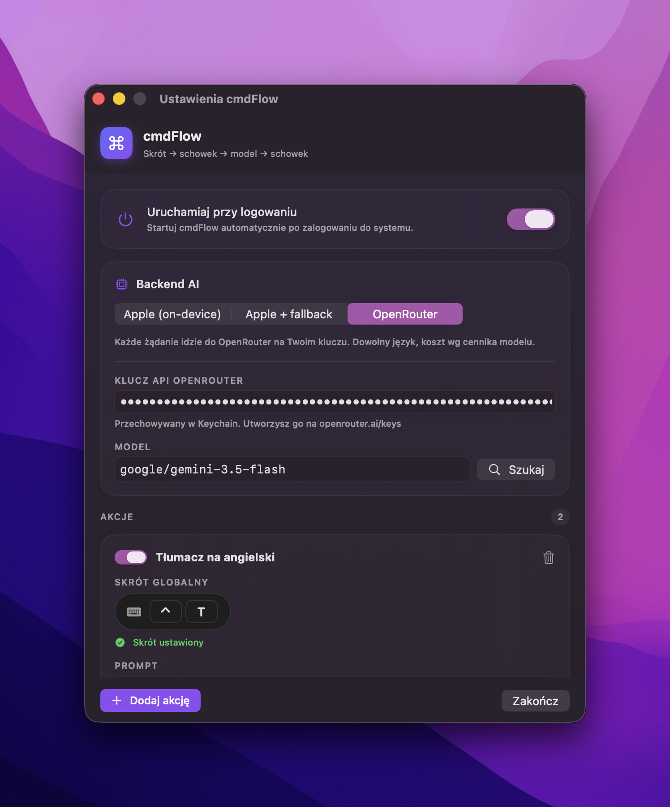
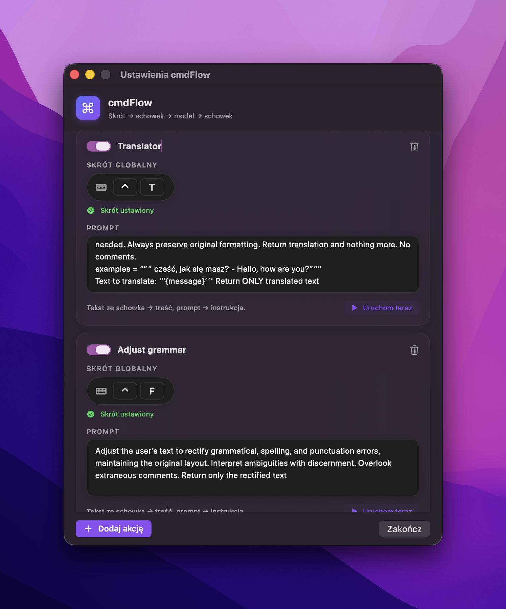

<div align="center">

# ⌘ cmdFlow

**Select. Copy. Press a shortcut. Paste the result.**

A macOS app that runs your clipboard text through an AI model under a global keyboard shortcut — on-device by default (Apple Foundation Model), optionally via **OpenRouter** or **OpenAI**.

[](https://github.com/miekki-jerry/cmdFlow/releases)
[](LICENSE)
[](https://www.apple.com/macos/)

[**Landing page →**](https://cmd-flow-landing.vercel.app) &nbsp;·&nbsp; [Download](https://github.com/miekki-jerry/cmdFlow/releases/latest) &nbsp;·&nbsp; [Made by bogumilluc.pl](https://bogumilluc.pl)

 

</div>

---

## Why it exists

I keep copying a snippet and wanting to transform it fast — translate it, fix its grammar, summarize it — without pasting into ChatGPT, switching windows, and copying the result back. cmdFlow does that with a single shortcut, in place:

```
[global shortcut]  →  clipboard text  →  your prompt  →  AI model  →  result back to the clipboard
```

You define **actions** — each one is a pair of *global shortcut + prompt*. One translates to English, another fixes grammar, another summarizes. Copy some text, press the shortcut, paste the result.

## Three backends (and the Polish story)

The app is built around **Apple Foundation Models** — a model that runs **locally on your Mac**: private, free, no API key. It handles many languages well (EN/DE/FR/ES/IT/PT/JA/KO/ZH).

There is one concrete limitation that testing surfaced: **Polish input text is rejected** by the model's guardrail (`unsupportedLanguageOrLocale`), non-deterministically and with no prompt-level workaround. That is Apple's constraint, not the app's — Polish is not an officially supported input language for Apple Intelligence yet.

So cmdFlow ships **three backend modes**, switchable in Settings:

| Mode | What it does |
|---|---|
| **Apple (on-device)** | Apple Intelligence, locally. Private, free, no key. Limited languages. |
| **Apple + fallback** | Apple first; if it refuses (e.g. Polish input), automatic fallback to the cloud. **Recommended for Polish.** |
| **Cloud** | Every request goes to the selected provider on your own API key. Any language, any model. |

Cloud provider: **OpenRouter** (300+ models, built-in search) or **OpenAI** (`gpt-5.5`, `gpt-5.4`, `gpt-5.4-mini`, …). Your API key is stored in the **Keychain**, never in plain text.

## How it works

1. **Copy** any text (`⌘C`).
2. **Press** your shortcut — cmdFlow reads the clipboard and runs the prompt.
3. **Paste** (`⌘V`) — the result is already in your clipboard.

## Features

- 🎹 **Global shortcuts** — Carbon `RegisterEventHotKey`, no Accessibility permission.
- ⚙️ **Multiple actions** — each with its own shortcut and prompt, persisted locally.
- 📸 **Screenshot chat (vision)** — a shortcut drops a region selector; a focused prompt pill appears, then a floating multi-turn chat about the capture (continue the conversation, history in the Chats tab, editable system prompt). Cloud-only (OpenRouter/OpenAI) — Apple's on-device model is text-only.
- 🔒 **On-device by default** — your text never leaves the Mac until you pick a cloud provider.
- ☁️ **OpenRouter + OpenAI** — your own key (in the Keychain), plus an OpenRouter model search.
- 🎬 **Animated shortcut recorder** — radar pulse, keycaps, and a warning on system collisions.
- 🚀 **Launch at login** — one toggle (`SMAppService`).
- 📍 **Stays out of the way** — no Dock icon; a quiet `⌘` in the menu bar that reflects state (working / success / error).

## Install

The app is **unsigned** (open source, no Apple Developer account), so Gatekeeper needs a one-time confirmation:

1. Download `cmdFlow-x.y.z.dmg` from [Releases](https://github.com/miekki-jerry/cmdFlow/releases), open it, and drag **cmdFlow** to **Applications**.
2. First launch: **right-click cmdFlow → Open** → *Open*.
3. If macOS claims the app is "damaged":
   ```bash
   xattr -dr com.apple.quarantine /Applications/cmdFlow.app
   ```

## Requirements

- **macOS 26 (Tahoe)+**, **Apple Silicon** (M1+)
- Apple mode: enable **Apple Intelligence** (System Settings → Apple Intelligence & Siri)
- Cloud mode: an API key from [OpenRouter](https://openrouter.ai/keys) or [OpenAI](https://platform.openai.com/api-keys) — works even if the device has no Apple Intelligence

## Build from source

```bash
git clone https://github.com/miekki-jerry/cmdFlow.git
cd cmdFlow
swift build -c release          # compile
./Scripts/build_app.sh 0.5.0    # assemble cmdFlow.app in dist/
./Scripts/make_release.sh 0.5.0 # + .dmg and .zip
```

Requires Xcode 26+ / Swift 6.2+. The app is an SPM package assembled into a `.app` by a script — no `.xcodeproj`.

## Architecture

| Component | Role |
|---|---|
| `HotKeyManager` | Global shortcuts via Carbon `RegisterEventHotKey` |
| `FoundationModelService` | Layer over `FoundationModels` with retry and error handling |
| `CloudChat` | Shared chat/completions client (OpenAI-compatible) |
| `OpenRouterService` / `OpenAIService` | Cloud providers + OpenRouter model listing |
| `Keychain` | Secure storage for API keys |
| `LaunchAtLogin` | Launch at login via `SMAppService` |
| `AppState` | Persists actions/settings, routes providers, registers shortcuts |
| `ShortcutRecorder` / `DesignKit` | Animated recorder and shared visual language |
| `RegionSelector` / `ScreenCapture` | Region selector overlay + ScreenCaptureKit capture |
| `SnapChat` | Floating vision-chat panel with glow-in animation |

## Author

Made by **Bogumił Łuć** — [bogumilluc.pl](https://bogumilluc.pl).
Landing page: [cmd-flow-landing.vercel.app](https://cmd-flow-landing.vercel.app)

## License

[MIT](LICENSE) © 2026 LUC LABS
